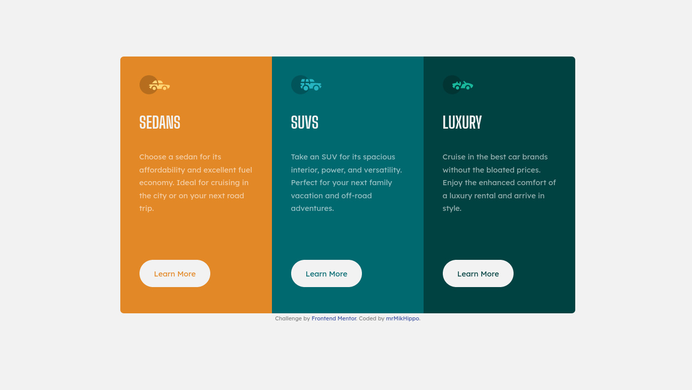

# Frontend Mentor - 3-column preview card component solution

This is a solution to the [3-column preview card component challenge on Frontend Mentor](https://www.frontendmentor.io/challenges/3column-preview-card-component-pH92eAR2-). Frontend Mentor challenges help you improve your coding skills by building realistic projects.

## Table of contents

- [Overview](#overview)
  - [The challenge](#the-challenge)
  - [Screenshot](#screenshot)
  - [Links](#links)
- [My process](#my-process)
  - [Built with](#built-with)
  - [What I learned](#what-i-learned)
  - [Continued development](#continued-development)
  - [Useful resources](#useful-resources)
- [Author](#author)

## Overview

### The challenge

Users should be able to:

- View the optimal layout depending on their device's screen size
- See hover states for interactive elements

### Screenshot

### Links

- Solution URL: [github](https://github.com/mrMikHippo/3-column-preview-card-component)
- Live Site URL: [http://3-cpcc.netlify.app](http://3-cpcc.netlify.app)

## My process

### Built with

- Semantic HTML5 markup
- CSS custom properties
- Flexbox
- Mobile-first workflow
- [Gulp.js](https://gulpjs.com) - Gulp toolkit
- Deployed with [Netlify](https://netlify.com)

### What I learned

I'm learned for more about Gulp toolkit.

### Continued development

- Environment modes for gulp (production and development)
- Flexbox and CSSGrid
- SASS

### Useful resources

- [Site generators](https://jamstack.org/generators/) - It is useful link for me

## Author

- Github - [mrMikHippo](https://github.com/mrMikHippo)
- Frontend Mentor - [@mrMikHippo](https://www.frontendmentor.io/profile/mrMikHippo)
